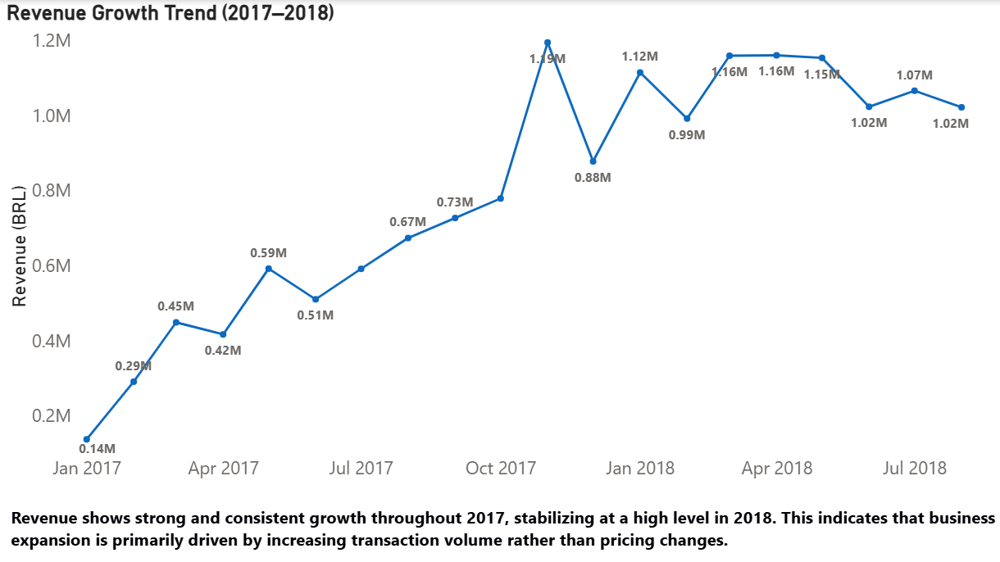
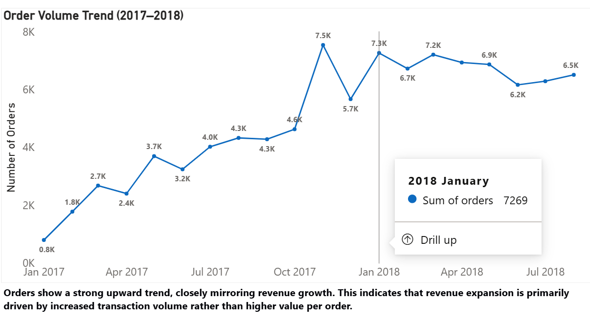
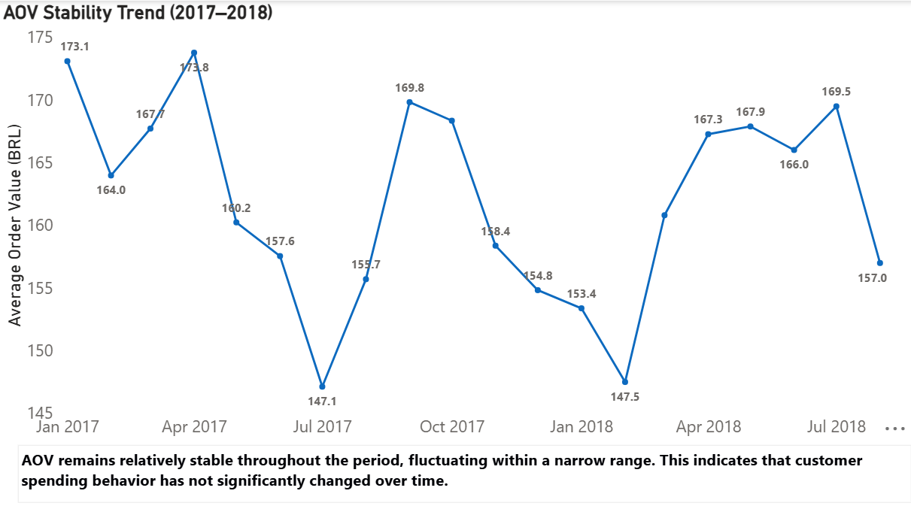
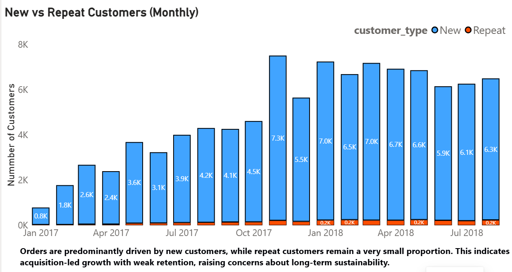
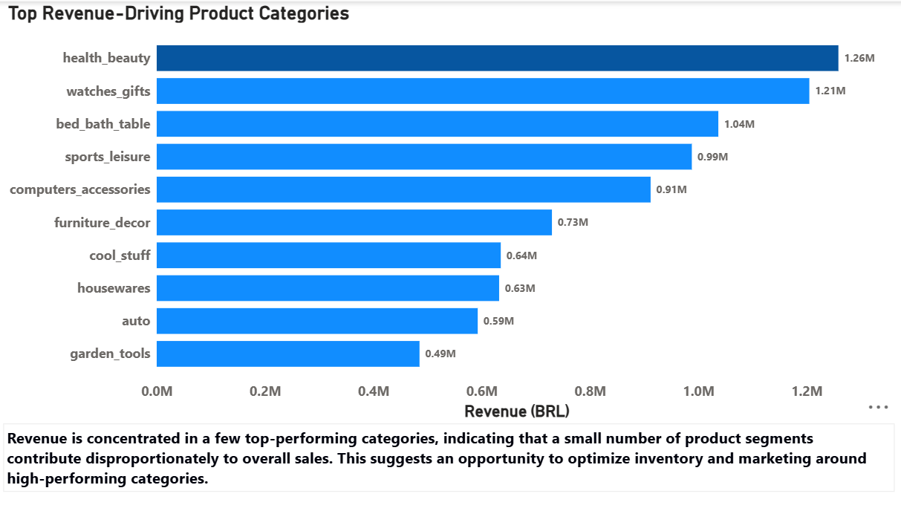

# E-commerce Growth & Customer Behavior Analysis (Olist Dataset)

---

## Overview

This project analyzes transactional e-commerce data to identify the **key drivers of revenue growth**, evaluate customer behavior, and assess **long-term business sustainability**.

The analysis decomposes revenue into its core components to determine whether growth is driven by **order volume, pricing, or customer acquisition dynamics**.

---

## Business Questions

* What is driving revenue growth?
* Is growth driven by **order volume or pricing (AOV)**?
* How strong is **customer retention**?
* Which product categories contribute most to revenue?
* Is the current growth trajectory **sustainable**?

---

## Key Findings

* **Revenue growth is primarily driven by increased order volume**
* **Average Order Value remains stable**, indicating no significant change in customer spending behavior
* **Growth is heavily dependent on new customer acquisition**
* **Repeat customer contribution is very low**, indicating weak retention
* **Revenue is concentrated in a few top-performing categories**

---

## Category Insight

**Revenue is concentrated in a few top-performing categories**, indicating that a small number of product segments contribute disproportionately to overall sales.
This creates an opportunity to **optimize inventory and marketing around high-performing categories**, while also highlighting **dependency risk**.

---

## Dashboard Highlights

### Revenue Trend

### Order Volume Trend

### Average Order Value (AOV)

### Customer Retention (New vs Repeat)

### Top Categories by Revenue

---

## Business Interpretation

The business shows **strong growth driven by transaction volume**, not pricing.

* **Revenue ↑ because Orders ↑**
* **AOV remains stable**, confirming no pricing-driven growth
* **Customer base is acquisition-heavy**, with limited repeat engagement

This indicates a **volume-driven growth model with weak retention**, raising concerns about **long-term sustainability**.

---

## Strategic Recommendations

* **Improve customer retention** through loyalty programs and re-engagement strategies
* **Increase repeat purchases** using targeted promotions and personalization
* **Focus marketing investment on high-performing categories** to maximize ROI
* **Diversify category performance** to reduce dependency risk
* Monitor AOV for **pricing and bundling opportunities**

---

## Technical Approach

* Used SQL aggregations (**SUM, COUNT, GROUP BY**) for KPI calculation
* Applied **CTEs** to identify new vs repeat customers
* Performed **multi-table joins** across orders, customers, and products
* Built a **Power BI dashboard** to visualize trends and insights

---

## Project Structure

* `data/` — processed datasets
* `sql/` — analysis queries
* `dashboard/` — Power BI file
* `images/` — visual outputs

---

## Conclusion

The analysis shows that **growth is volume-driven rather than value-driven**, with a strong dependence on **new customer acquisition**.

To sustain growth, the business must focus on **improving retention and reducing dependency on a limited set of product categories**.

---
